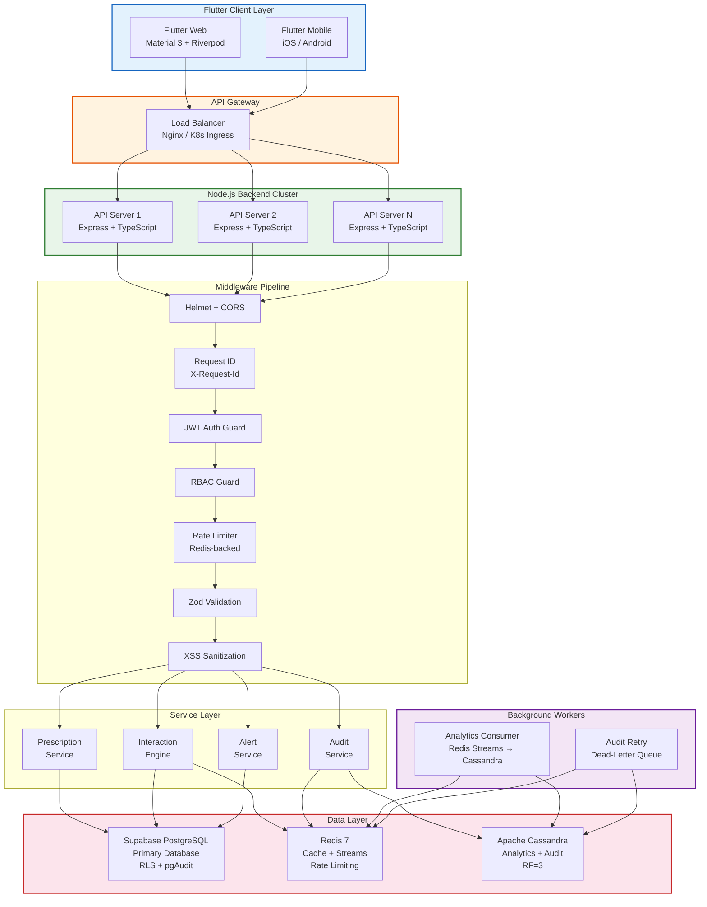
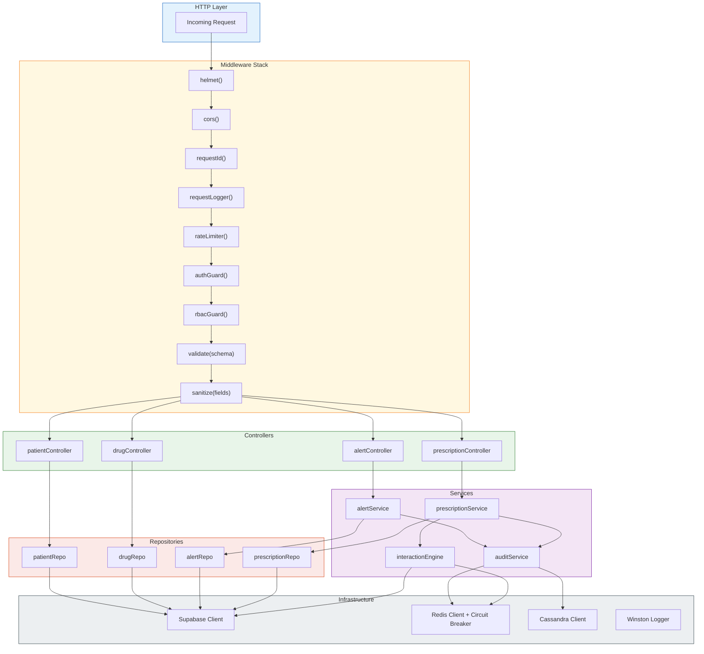
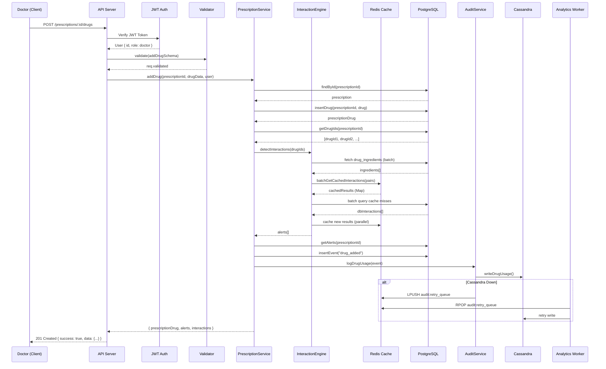
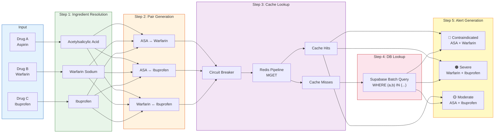
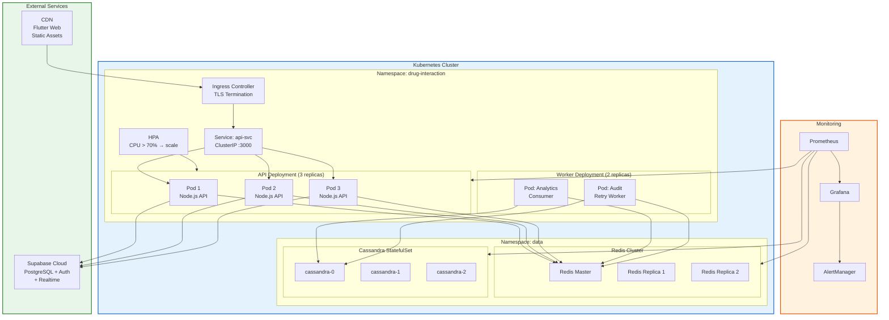

# Drug Interaction Safety System — Architecture Diagrams

> These diagrams are suitable for final-year project reports, technical theses, and startup engineering documentation.

---

## 1. System Architecture Diagram



### ASCII Version

```
┌─────────────────────────────────────────────────────────────────────────┐
│                        CLIENT LAYER                                     │
│   ┌──────────────────┐          ┌──────────────────┐                    │
│   │  Flutter Web     │          │  Flutter Mobile   │                   │
│   │  Material 3      │          │  iOS / Android    │                   │
│   │  Riverpod + Dio  │          │  Riverpod + Dio   │                   │
│   └────────┬─────────┘          └────────┬──────────┘                   │
└────────────┼─────────────────────────────┼──────────────────────────────┘
             │           HTTPS             │
             └─────────────┬───────────────┘
                           ▼
┌──────────────────────────────────────────────────────────────────────────┐
│                     API GATEWAY (Nginx / K8s Ingress)                    │
└──────────────────────────────┬───────────────────────────────────────────┘
                               │  Round Robin
                ┌──────────────┼──────────────┐
                ▼              ▼              ▼
┌──────────────────────────────────────────────────────────────────────────┐
│                    NODE.JS BACKEND CLUSTER                               │
│                                                                          │
│  ┌────────────────────── MIDDLEWARE PIPELINE ──────────────────────────┐ │
│  │ Helmet → CORS → RequestID → JWT Auth → RBAC → Rate Limit → Zod    │ │
│  │ → XSS Sanitize                                                     │ │
│  └────────────────────────────┬───────────────────────────────────────┘ │
│                               │                                          │
│  ┌────────────────────── CONTROLLER LAYER ────────────────────────────┐ │
│  │  PrescriptionCtrl  │  AlertCtrl  │  DrugCtrl  │  PatientCtrl      │ │
│  └────────────┬───────┴──────┬──────┴─────┬──────┴───────────────────┘ │
│               │              │            │                              │
│  ┌────────────────────── SERVICE LAYER ───────────────────────────────┐ │
│  │  PrescriptionSvc  │  AlertSvc  │  InteractionEngine │  AuditSvc   │ │
│  └────────────┬───────┴──────┬──────┴─────┬──────┬───────────────────┘ │
│               │              │            │      │                       │
│  ┌────────────────────── REPOSITORY LAYER ───────────────────────────┐ │
│  │  PrescriptionRepo  │  AlertRepo  │  DrugRepo  │  PatientRepo     │ │
│  └────────────────────┴─────────────┴────────────┴───────────────────┘ │
└───────────┬──────────────────┬────────────────────┬──────────────────────┘
            │                  │                    │
            ▼                  ▼                    ▼
┌───────────────────┐ ┌────────────────┐ ┌──────────────────┐
│  Supabase         │ │  Redis 7       │ │  Cassandra       │
│  PostgreSQL       │ │                │ │  Cluster         │
│  ──────────────── │ │  ──────────────│ │  ────────────────│
│  • Tables + RLS   │ │  • Interaction │ │  • Alert logs    │
│  • Triggers       │ │    cache       │ │  • Audit events  │
│  • pgAudit        │ │  • Rate limits │ │  • Analytics     │
│  • Severity rank  │ │  • Streams     │ │  • Mat. views    │
│  • Retention pol. │ │  • Dead-letter │ │  • TTL: 1-2 yr   │
└───────────────────┘ └────────────────┘ └──────────────────┘
```

---

## 2. Layered Architecture Diagram



---

## 3. Data Flow Diagram



---

## 4. Interaction Detection Pipeline



### ASCII Version

```
                    INTERACTION DETECTION PIPELINE
    ┌──────────────────────────────────────────────────────────┐
    │                                                          │
    │  ┌─────────┐  ┌─────────┐  ┌─────────┐                 │
    │  │ Drug A  │  │ Drug B  │  │ Drug C  │   INPUT          │
    │  │ Aspirin │  │Warfarin │  │Ibuprofen│                  │
    │  └────┬────┘  └────┬────┘  └────┬────┘                  │
    │       │            │            │                        │
    │       ▼            ▼            ▼                        │
    │  ┌─────────────────────────────────────┐                │
    │  │ STEP 1: Resolve Ingredients         │                │
    │  │ Acetylsalicylic Acid, Warfarin      │                │
    │  │ Sodium, Ibuprofen                   │                │
    │  └──────────────────┬──────────────────┘                │
    │                     │                                    │
    │                     ▼                                    │
    │  ┌─────────────────────────────────────┐                │
    │  │ STEP 2: Generate Canonical Pairs    │                │
    │  │ (ASA,Warfarin) (ASA,Ibu) (War,Ibu) │                │
    │  │ Total pairs: n(n-1)/2 × m²         │                │
    │  └──────────────────┬──────────────────┘                │
    │                     │                                    │
    │           ┌─────────┴──────────┐                        │
    │           ▼                    ▼                         │
    │  ┌────────────────┐  ┌─────────────────┐               │
    │  │ STEP 3: Redis  │  │ Circuit Breaker │               │
    │  │ Pipeline MGET  │  │ (opossum)       │               │
    │  │ Single RTT     │  │ Fallback: DB    │               │
    │  └───┬────────┬───┘  └─────────────────┘               │
    │      │        │                                          │
    │   Hits     Misses                                        │
    │      │        │                                          │
    │      │        ▼                                          │
    │      │  ┌─────────────────┐                             │
    │      │  │ STEP 4: Supabase│                             │
    │      │  │ Batch Query     │                             │
    │      │  │ WHERE (a,b) IN  │                             │
    │      │  └────────┬────────┘                             │
    │      │           │                                       │
    │      └─────┬─────┘                                      │
    │            ▼                                             │
    │  ┌─────────────────────────────────────┐                │
    │  │ STEP 5: Deduplicate + Sort          │                │
    │  │ 🔴 contraindicated (rank 1)         │                │
    │  │ 🟠 severe          (rank 2)         │                │
    │  │ 🟡 moderate        (rank 3)         │                │
    │  │ 🟢 mild            (rank 4)         │                │
    │  └─────────────────────────────────────┘                │
    └──────────────────────────────────────────────────────────┘
```

---

## 5. Deployment Architecture



### ASCII Version

```
┌──────────────────── KUBERNETES CLUSTER ──────────────────────────────┐
│                                                                       │
│  ┌─────────────── namespace: drug-interaction ─────────────────────┐ │
│  │                                                                  │ │
│  │  ┌──────────────────────────────────────────────┐               │ │
│  │  │          INGRESS CONTROLLER                   │               │ │
│  │  │          TLS + Rate Limiting                  │               │ │
│  │  └──────────────────┬───────────────────────────┘               │ │
│  │                     │                                            │ │
│  │     ┌───────────────┼───────────────┐                           │ │
│  │     ▼               ▼               ▼                           │ │
│  │  ┌──────┐       ┌──────┐       ┌──────┐                        │ │
│  │  │Pod 1 │       │Pod 2 │       │Pod 3 │  API (HPA: 3-10)      │ │
│  │  │API   │       │API   │       │API   │                        │ │
│  │  └──┬───┘       └──┬───┘       └──┬───┘                        │ │
│  │     │               │               │                            │ │
│  │  ┌──────┐       ┌──────┐                                        │ │
│  │  │Worker│       │Worker│    Workers (2 replicas)                │ │
│  │  │Analyt│       │Audit │                                        │ │
│  │  └──┬───┘       └──┬───┘                                        │ │
│  └─────┼───────────────┼────────────────────────────────────────────┘ │
│        │               │                                               │
│  ┌─────┼───── namespace: data ──────────────────────────────────────┐ │
│  │     │               │                                             │ │
│  │  ┌──▼───────────────▼──┐    ┌──────────────────────────────┐    │ │
│  │  │   REDIS CLUSTER     │    │   CASSANDRA STATEFULSET      │    │ │
│  │  │   Master + 2 Repl.  │    │   3 nodes, RF=3              │    │ │
│  │  │   Cache + Streams   │    │   Analytics + Audit          │    │ │
│  │  └─────────────────────┘    └──────────────────────────────┘    │ │
│  └───────────────────────────────────────────────────────────────────┘ │
└───────────────────────────────────────────────────────────────────────┘
         │                            │
         ▼                            ▼
┌─────────────────┐          ┌─────────────────┐
│ Supabase Cloud  │          │  CDN / Vercel   │
│ PostgreSQL+Auth │          │  Flutter Web    │
│ RLS + Realtime  │          │  Static Assets  │
└─────────────────┘          └─────────────────┘
```
