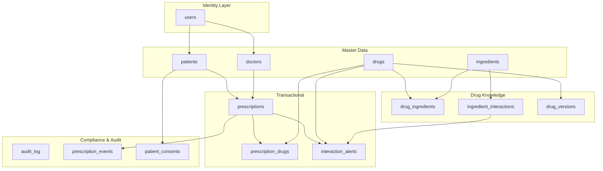

# Drug Safety Guard — Comprehensive Supabase Database Report

> **Project**: Drug Interaction Safety & Prescription Validation System  
> **Database**: PostgreSQL via Supabase  
> **Schema File**: `database/postgresql/schema.sql` (925 lines)  
> **Migrations**: `database/migrations/002–005`  
> **Generated**: 17 March 2026

---

## 1. Architecture Overview

The Supabase backend follows a **three-layer** architecture:

```
┌─────────────────────────────────────────────────────────────┐
│                     CLIENT LAYER                            │
│  Flutter App (supabase_flutter)  │  Web Dashboard           │
│  Auth (PKCE) · Realtime · REST  │  REST API calls           │
└──────────────────┬──────────────┴──────────────┬────────────┘
                   │                              │
┌──────────────────▼──────────────────────────────▼────────────┐
│                  BACKEND API LAYER (Node.js)                 │
│  Express Server · JWT Auth · Rate Limiting · CORS            │
│  Repositories: drugRepo · prescriptionRepo · alertRepo       │
│  Supabase JS Client (service_role key)                       │
└──────────────────┬──────────────────────────────────────────┘
                   │
┌──────────────────▼──────────────────────────────────────────┐
│              SUPABASE DATABASE LAYER (PostgreSQL)            │
│  13 Tables · 5 Custom ENUMs · RLS Policies · Triggers       │
│  Stored Functions · Audit Log · pgsodium Encryption          │
│  Extensions: uuid-ossp · pg_trgm · pgsodium                 │
└─────────────────────────────────────────────────────────────┘
```

**Key Supabase features used:**
- **Supabase Auth** — PKCE-based authentication, JWT tokens
- **Row Level Security (RLS)** — Role-based access control (patient, doctor, pharmacist, admin)
- **Realtime** — Live subscription to `interaction_alerts` via PostgreSQL CDC
- **pgsodium** — Column-level encryption for PHI (Protected Health Information)
- **Auto-generated REST API** — PostgREST for CRUD operations

---

## 2. PostgreSQL Extensions

| Extension | Purpose |
|-----------|---------|
| `uuid-ossp` | Generates UUID v4 primary keys (`uuid_generate_v4()`) |
| `pg_trgm` | Trigram-based fuzzy text search on drug/ingredient names |
| `pgsodium` | Column-level encryption for HIPAA-compliant PHI storage |

---

## 3. Custom ENUM Types

Five custom types enforce domain constraints at the database level:

| Type | Values | Used In |
|------|--------|---------|
| `severity_level` | `mild`, `moderate`, `severe`, `contraindicated` | `ingredient_interactions`, `interaction_alerts` |
| `prescription_status` | `draft`, `pending_review`, `approved`, `dispensed`, `cancelled` | `prescriptions` |
| `user_role` | `patient`, `doctor`, `admin`, `pharmacist` | `users` |
| `alert_status` | `active`, `acknowledged`, `overridden`, `resolved` | `interaction_alerts` |
| `consent_type` | `treatment`, `data_sharing`, `research` | `patient_consents` |

---

## 4. Database Schema — Complete Table Reference

### 4.1 Table Overview

The 13 tables are organized into **5 logical layers**:



---

### 4.2 Identity Layer

#### `users`
Central authentication table linked to Supabase Auth.

| Column | Type | Constraints |
|--------|------|-------------|
| `id` | UUID | PK, `uuid_generate_v4()` |
| `auth_id` | UUID | UNIQUE, NOT NULL — links to Supabase Auth UID |
| `email` | VARCHAR(255) | UNIQUE, NOT NULL |
| `full_name` | VARCHAR(255) | NOT NULL |
| `role` | `user_role` | NOT NULL, DEFAULT `'patient'` |
| `phone` | VARCHAR(20) | — |
| `is_active` | BOOLEAN | NOT NULL, DEFAULT `TRUE` |
| `last_login_at` | TIMESTAMPTZ | — |
| `created_at` | TIMESTAMPTZ | NOT NULL, DEFAULT `NOW()` |
| `updated_at` | TIMESTAMPTZ | NOT NULL, DEFAULT `NOW()` |
| `deleted_at` | TIMESTAMPTZ | Soft delete |

**Indexes**: `auth_id`, `email`, `role` (all partial: `WHERE deleted_at IS NULL`)

---

### 4.3 Master Data Layer

#### `patients`

| Column | Type | Constraints |
|--------|------|-------------|
| `id` | UUID | PK |
| `user_id` | UUID | FK → `users(id)` ON DELETE SET NULL |
| `first_name` | VARCHAR(100) | NOT NULL |
| `last_name` | VARCHAR(100) | NOT NULL |
| `date_of_birth` | DATE | NOT NULL |
| `gender` | VARCHAR(20) | — |
| `blood_type` | VARCHAR(5) | — |
| `allergies` | TEXT[] | Array, CHECK ≤100 items, **ENCRYPTED (pgsodium)** |
| `medical_conditions` | TEXT[] | Array, CHECK ≤50 items, **ENCRYPTED (pgsodium)** |
| `emergency_contact_name` | VARCHAR(200) | — |
| `emergency_contact_phone` | VARCHAR(20) | — |
| `insurance_id` | VARCHAR(100) | — |
| `created_at / updated_at / deleted_at` | TIMESTAMPTZ | Standard timestamps |

**Indexes**: `user_id`, `(last_name, first_name)`, `date_of_birth`

#### `doctors`

| Column | Type | Constraints |
|--------|------|-------------|
| `id` | UUID | PK |
| `user_id` | UUID | FK → `users(id)` ON DELETE SET NULL |
| `first_name` | VARCHAR(100) | NOT NULL |
| `last_name` | VARCHAR(100) | NOT NULL |
| `specialization` | VARCHAR(200) | NOT NULL |
| `license_number` | VARCHAR(100) | UNIQUE, NOT NULL |
| `hospital_id` | UUID | — |
| `department` | VARCHAR(200) | — |
| `is_active` | BOOLEAN | NOT NULL, DEFAULT `TRUE` |

**Indexes**: `user_id`, `license_number`, `specialization`

#### `drugs`

| Column | Type | Constraints |
|--------|------|-------------|
| `id` | UUID | PK |
| `brand_name` | VARCHAR(255) | NOT NULL |
| `generic_name` | VARCHAR(255) | NOT NULL |
| `drug_class` | VARCHAR(200) | — |
| `manufacturer` | VARCHAR(255) | — |
| `ndc_code` | VARCHAR(50) | UNIQUE (National Drug Code) |
| `dosage_form` | VARCHAR(100) | — |
| `strength` | VARCHAR(100) | — |
| `route_of_administration` | VARCHAR(100) | — |
| `is_active` | BOOLEAN | NOT NULL, DEFAULT `TRUE` |
| `requires_prescription` | BOOLEAN | NOT NULL, DEFAULT `TRUE` |
| `description` | TEXT | — |

**Indexes**: `brand_name` (GIN/trigram), `generic_name` (GIN/trigram), `drug_class`, `ndc_code`

> Trigram indexes (`pg_trgm`) enable **fuzzy search** — e.g., searching "warfrin" matches "Warfarin".

#### `ingredients`

| Column | Type | Constraints |
|--------|------|-------------|
| `id` | UUID | PK |
| `name` | VARCHAR(255) | UNIQUE, NOT NULL |
| `cas_number` | VARCHAR(50) | Chemical Abstracts Service number |
| `category` | VARCHAR(200) | — |
| `description` | TEXT | — |

**Indexes**: `name` (GIN/trigram), `cas_number`

---

### 4.4 Drug Knowledge Layer

#### `drug_ingredients` (Junction Table)

| Column | Type | Constraints |
|--------|------|-------------|
| `drug_id` | UUID | FK → `drugs(id)` CASCADE |
| `ingredient_id` | UUID | FK → `ingredients(id)` CASCADE |
| `is_active_ingredient` | BOOLEAN | DEFAULT `TRUE` |
| `concentration` | VARCHAR(100) | — |
| `unit` | VARCHAR(50) | — |

**Primary Key**: Composite `(drug_id, ingredient_id)`

#### `ingredient_interactions`

| Column | Type | Constraints |
|--------|------|-------------|
| `id` | UUID | PK |
| `ingredient_a_id` | UUID | FK → `ingredients(id)` CASCADE |
| `ingredient_b_id` | UUID | FK → `ingredients(id)` CASCADE |
| `severity` | `severity_level` | NOT NULL |
| `clinical_effect` | TEXT | NOT NULL |
| `mechanism` | TEXT | — |
| `recommendation` | TEXT | NOT NULL |
| `evidence_level` | VARCHAR(50) | established / theoretical / case_report |
| `source_reference` | TEXT | — |

**Constraints**:
- `CHECK (ingredient_a_id < ingredient_b_id)` — Canonical ordering prevents duplicate pairs
- `UNIQUE (ingredient_a_id, ingredient_b_id)` — No duplicate interaction records

**Indexes**: `ingredient_a_id`, `ingredient_b_id`, `severity`

#### `drug_versions`

| Column | Type | Constraints |
|--------|------|-------------|
| `id` | UUID | PK |
| `drug_id` | UUID | FK → `drugs(id)` CASCADE |
| `version_number` | INT | NOT NULL |
| `changes` | JSONB | NOT NULL |
| `full_snapshot` | JSONB | NOT NULL, DEFAULT `'{}'` (added in migration 002) |
| `approved_by` | UUID | FK → `users(id)` SET NULL |
| `effective_date` | DATE | NOT NULL |

**Constraint**: `UNIQUE (drug_id, version_number)`

---

### 4.5 Transactional Layer

#### `prescriptions`

| Column | Type | Constraints |
|--------|------|-------------|
| `id` | UUID | PK |
| `patient_id` | UUID | FK → `patients(id)` **RESTRICT** |
| `doctor_id` | UUID | FK → `doctors(id)` **RESTRICT** |
| `status` | `prescription_status` | NOT NULL, DEFAULT `'draft'` |
| `diagnosis` | TEXT | **ENCRYPTED (pgsodium)** |
| `notes` | TEXT | **ENCRYPTED (pgsodium)** |
| `prescribed_at` | TIMESTAMPTZ | NOT NULL, DEFAULT `NOW()` |
| `valid_until` | TIMESTAMPTZ | — |
| `pharmacy_id` | UUID | — |

**Indexes**: `patient_id`, `doctor_id`, `status`, `prescribed_at DESC`

> Uses `ON DELETE RESTRICT` — cannot accidentally delete a patient or doctor with active prescriptions.

#### `prescription_drugs` (Junction Table)

| Column | Type | Constraints |
|--------|------|-------------|
| `id` | UUID | PK |
| `prescription_id` | UUID | FK → `prescriptions(id)` CASCADE |
| `drug_id` | UUID | FK → `drugs(id)` **RESTRICT** |
| `dosage` | VARCHAR(100) | NOT NULL |
| `frequency` | VARCHAR(100) | NOT NULL |
| `duration` | VARCHAR(100) | — |
| `instructions` | TEXT | — |

**Constraint**: `UNIQUE (prescription_id, drug_id)` — prevents duplicate drugs per prescription

#### `interaction_alerts`

| Column | Type | Constraints |
|--------|------|-------------|
| `id` | UUID | PK |
| `prescription_id` | UUID | FK → `prescriptions(id)` CASCADE |
| `drug_a_id` | UUID | FK → `drugs(id)` CASCADE |
| `drug_b_id` | UUID | FK → `drugs(id)` CASCADE |
| `ingredient_a_id` | UUID | FK → `ingredients(id)` CASCADE |
| `ingredient_b_id` | UUID | FK → `ingredients(id)` CASCADE |
| `interaction_id` | UUID | FK → `ingredient_interactions(id)` CASCADE |
| `severity` | `severity_level` | NOT NULL |
| `clinical_effect` | TEXT | NOT NULL |
| `recommendation` | TEXT | NOT NULL |
| `status` | `alert_status` | NOT NULL, DEFAULT `'active'` |
| `acknowledged_by` | UUID | FK → `users(id)` SET NULL |
| `acknowledged_at` | TIMESTAMPTZ | — |
| `override_reason` | TEXT | — |

**Indexes**: `prescription_id`, `severity`, `status`, `created_at DESC`, deduplication index `(prescription_id, interaction_id)`, `acknowledged_by`

---

### 4.6 Compliance & Audit Layer

#### `audit_log`

| Column | Type | Constraints |
|--------|------|-------------|
| `id` | UUID | PK |
| `user_id` | UUID | FK → `users(id)` SET NULL |
| `action` | VARCHAR(100) | NOT NULL |
| `table_name` | VARCHAR(100) | NOT NULL |
| `record_id` | UUID | — |
| `old_values` | JSONB | — |
| `new_values` | JSONB | — |
| `ip_address` | INET | — |
| `user_agent` | TEXT | — |

**Indexes**: `user_id`, `action`, `table_name`, `created_at DESC`, `(table_name, record_id)`

#### `prescription_events`

| Column | Type | Constraints |
|--------|------|-------------|
| `id` | UUID | PK |
| `prescription_id` | UUID | FK → `prescriptions(id)` CASCADE |
| `event_type` | VARCHAR(100) | NOT NULL (created, drug_added, drug_removed, approved, etc.) |
| `event_data` | JSONB | — |
| `performed_by` | UUID | FK → `users(id)` SET NULL |

#### `patient_consents`

| Column | Type | Constraints |
|--------|------|-------------|
| `id` | UUID | PK |
| `patient_id` | UUID | FK → `patients(id)` CASCADE |
| `consent_type` | `consent_type` | NOT NULL (treatment / data_sharing / research) |
| `granted` | BOOLEAN | NOT NULL, DEFAULT `FALSE` |
| `granted_at / revoked_at` | TIMESTAMPTZ | — |
| `document_url` | TEXT | — |
| `ip_address` | INET | — |

---

## 5. Triggers & Functions

### 5.1 Auto-Updated Timestamps

A generic `update_updated_at_column()` function is applied to **12 tables** via a dynamic DO block. Every `UPDATE` automatically sets `updated_at = NOW()`.

### 5.2 Drug Interaction Detection Trigger

```
TRIGGER: trg_check_interactions
EVENT:   AFTER INSERT ON prescription_drugs
ACTION:  fn_check_drug_interactions()
```

**How it works:**
1. When a new drug is added to a prescription, the trigger fires
2. It finds all ingredients of the new drug via `drug_ingredients`
3. For each existing drug in the same prescription, it finds their ingredients
4. It cross-references all ingredient pairs against `ingredient_interactions`
5. For each match, it inserts a row into `interaction_alerts` (with deduplication)

This ensures **zero-miss detection** — every dangerous combination is caught at the database level, regardless of how data enters the system.

### 5.3 Alert Audit Trigger

```
TRIGGER: trg_audit_alert
EVENT:   AFTER INSERT ON interaction_alerts
ACTION:  fn_audit_alert_insert()
```

Every new alert is automatically logged to `audit_log` with the prescription ID, drug pair, severity, and clinical effect as JSONB.

### 5.4 Drug Version Snapshot Trigger

```
TRIGGER: trg_drug_version_snapshot
EVENT:   AFTER UPDATE ON drugs
ACTION:  fn_drug_version_snapshot()
```

Captures a full `row_to_json(OLD)` snapshot when a drug record is updated, stored in `drug_versions.full_snapshot` for complete rollback capability.

---

## 6. Stored Functions

| Function | Parameters | Returns | Purpose |
|----------|-----------|---------|---------|
| `check_prescription_safety(UUID)` | prescription_id | Table of alerts | Returns all active alerts for a prescription with drug/ingredient names and severity ordering |
| `get_patient_drug_history(UUID)` | patient_id | Table of prescriptions | Full prescription timeline with drugs, dosages, alert counts, and max severity per prescription |
| `severity_rank(severity_level)` | ENUM → INT | INT (1–4) | Converts severity to numeric for correct `MAX()` aggregation |
| `rank_to_severity(INT)` | INT → ENUM | severity_level | Converts numeric rank back to ENUM |
| `user_role()` | — | user_role | Helper for RLS: returns current authenticated user's role |
| `app_user_id()` | — | UUID | Helper for RLS: returns current authenticated user's internal ID |
| `enforce_retention_policy()` | — | void | HIPAA data retention: hard-deletes records soft-deleted >7 years ago |

---

## 7. Row Level Security (RLS)

RLS is enabled on **all 13 tables**, enforcing role-based access at the database level.

### Access Matrix

| Table | Patient | Doctor | Pharmacist | Admin |
|-------|---------|--------|------------|-------|
| `users` | Own record | Own record | Own record | All |
| `patients` | Own record | All | — | All |
| `doctors` | Read all | Own record | — | All (CRUD) |
| `drugs` | Read | Read | Read | Full CRUD |
| `ingredients` | Read | Read | Read | Full CRUD |
| `ingredient_interactions` | Read | Read | Read | Full CRUD |
| `prescriptions` | Own prescriptions | Own prescriptions | All (read) | All |
| `prescription_drugs` | Own prescriptions | Own prescriptions | Own prescriptions | All |
| `interaction_alerts` | Own prescriptions | Own + update any | — | All |
| `audit_log` | — | — | — | Read + Insert |
| `patient_consents` | Own records | Read all | — | All |
| `prescription_events` | — | — | — | — |
| `drug_versions` | — | — | — | — |

### Key RLS Design Decisions

1. **`SECURITY INVOKER`** — The `auth.user_role()` function runs as the calling user, not the function owner (safer than `SECURITY DEFINER`)
2. **Pharmacist access** — Pharmacists can read prescriptions (needed for dispensing verification) but cannot modify them
3. **Audit integrity** — Only admin and `service_role` can insert audit logs, preventing log pollution
4. **Flattened policies** — Migration 003 replaced triple-nested subqueries with `EXISTS`-based JOIN rewrites for O(n) instead of O(n³) query plans

---

## 8. Migrations

### Migration 002: Schema Fixes

| ID | Fix | Details |
|----|-----|---------|
| DB-01 | Alert deduplication index | `idx_alerts_dedup(prescription_id, interaction_id)` prevents sequential scans in trigger |
| DB-02 | Severity ranking functions | `severity_rank()` and `severity_from_rank()` for correct MAX aggregation |
| DB-03 | Drug version snapshots | Added `full_snapshot JSONB` column + trigger for complete OLD row capture |
| DB-04 | Redundant index cleanup | Dropped `idx_interactions_pair` (redundant with UNIQUE constraint) |
| DB-05 | Acknowledger index | `idx_alerts_acknowledged_by` for lookup queries |
| S-06 | Array length constraints | `CHECK` on `patients.allergies ≤ 100` and `medical_conditions ≤ 50` |

### Migration 003: RLS Hardening

| ID | Fix | Details |
|----|-----|---------|
| RLS-01 | Split `drugs_modify` | Separated `FOR ALL` into explicit `INSERT/UPDATE/DELETE` policies |
| RLS-02 | Pharmacist prescriptions | Added pharmacist to `prescriptions_select` policy |
| RLS-03 | Flattened subqueries | Rewrote triple-nested → EXISTS-based for performance |
| RLS-04 | Security invoker | Changed `auth.user_role()` from `SECURITY DEFINER` to `SECURITY INVOKER` |
| RLS-05 | Audit log restriction | INSERT restricted to admin + service_role only |

### Migration 004: Data Retention & Encryption

- **HIPAA retention policy**: `enforce_retention_policy()` hard-deletes records soft-deleted >7 years ago (6-year HIPAA minimum + 1-year buffer)
- Scheduled via `pg_cron`: runs weekly on Sundays at 3:00 AM
- Results logged to `audit_log` with deletion counts

### Migration 005: pgsodium Encryption

**Encrypted PHI columns** (Transparent Column Encryption):
- `patients.allergies`
- `patients.medical_conditions`
- `prescriptions.diagnosis`
- `prescriptions.notes`

Encryption uses `aead-det` key type. Data is encrypted at rest, automatically decrypted during queries (transparent to application code).

---

## 9. Application Integration

### 9.1 Backend (Node.js/Express)

The backend uses the **Supabase JS client** with the `service_role` key for privileged operations.

**Repository pattern** with 4 repository files:

| Repository | Tables Accessed | Key Operations |
|------------|----------------|----------------|
| `drugRepo.js` | `drugs`, `ingredients`, `drug_ingredients`, `ingredient_interactions` | CRUD, fuzzy search (`ilike`), ingredient lookup |
| `prescriptionRepo.js` | `prescriptions`, `prescription_drugs`, `interaction_alerts`, `prescription_events` | Create prescription, add/remove drugs, get alerts, log events |
| `alertRepo.js` | `interaction_alerts`, `audit_log` | List/filter/acknowledge/batch-acknowledge alerts, audit logging |
| `patientRepo.js` | `patients` | Patient CRUD |

**Environment variables** (validated via Zod schema at startup):
- `SUPABASE_URL` — Project URL
- `SUPABASE_ANON_KEY` — Client-side key (respects RLS)
- `SUPABASE_SERVICE_KEY` — Server-side key (bypasses RLS)
- `JWT_SECRET` — For JWT verification

### 9.2 Flutter App

The `SupabaseService` singleton provides:

| Feature | Implementation |
|---------|---------------|
| **Authentication** | PKCE auth flow, email/password sign-in/sign-up, password reset |
| **User Profile** | Fetches from `users` table via `auth_id` |
| **Realtime Alerts** | Subscribes to `interaction_alerts` INSERT events via PostgreSQL CDC |
| **Filtered Realtime** | Per-prescription alert subscription using `PostgresChangeFilter` |

---

## 10. Seed Data Summary

| Table | Records | Notes |
|-------|---------|-------|
| Ingredients | 12 | Warfarin, Aspirin, Ibuprofen, Metformin, etc. |
| Drugs | 11 | Coumadin, Bayer Aspirin, Advil, Glucophage, etc. |
| Drug-Ingredient Mappings | 11 | 1:1 drug → ingredient |
| Ingredient Interactions | 10 | 2 contraindicated, 4 severe, 4 moderate |
| Patients | 3 | Alice Thompson, Robert Chen, Maria Garcia |
| Doctors | 2 | Dr. James Wilson, Dr. Sarah Patel |

Additional seed data (`seed_data.sql`) expands to:
- **25 ingredients**, **25 drugs**, **22 interactions**, **10 patients**, **4 doctors**, **15 prescriptions**, **35 prescription drugs**, **~65 interaction alerts**

---

## 11. Soft Delete Pattern

All tables use a `deleted_at TIMESTAMPTZ` column for soft deletes:
- **Active records**: `deleted_at IS NULL`
- **Deleted records**: `deleted_at = <timestamp>`
- **All partial indexes** filter on `WHERE deleted_at IS NULL`
- **Retention policy** hard-deletes records where `deleted_at > 7 years ago`

This ensures deleted data can be recovered within the retention window while maintaining query performance through partial indexes.

---

## 12. Indexing Strategy

| Index Type | Count | Purpose |
|------------|-------|---------|
| B-tree (regular) | ~30 | Foreign keys, equality/range lookups |
| GIN + pg_trgm | 3 | Fuzzy text search on `drugs.brand_name`, `drugs.generic_name`, `ingredients.name` |
| Partial indexes | ~25 | Filter `WHERE deleted_at IS NULL` — excludes soft-deleted rows from index |
| Composite indexes | 4 | Deduplication, audit record lookup, patient name search |
| Unique constraints | 6 | `ndc_code`, `license_number`, `email`, drug pairs, ingredient pairs, prescription-drug pairs |

---

## 13. Key Design Decisions

| Decision | Rationale |
|----------|-----------|
| **UUID primary keys** | Globally unique, safe for distributed systems and Supabase Realtime |
| **Ingredient-level interactions** | More accurate than drug-level — one drug may contain multiple active ingredients |
| **Canonical ingredient ordering** | `CHECK (ingredient_a_id < ingredient_b_id)` prevents storing (A,B) and (B,A) duplicates |
| **RESTRICT on patient/doctor deletion** | Prevents accidental loss of prescription history |
| **CASCADE on prescription deletion** | Cleaning up a prescription removes all associated drugs and alerts |
| **JSONB for audit/events** | Flexible schema for diverse event types without table-per-event-type explosion |
| **PostgreSQL arrays for allergies** | Native array type avoids junction table overhead for simple lists |
| **Separate users table** | Decouples app identity from Supabase Auth, enabling role management |

---

## 14. HIPAA Compliance Features

| Feature | Implementation |
|---------|---------------|
| **Encryption at rest** | pgsodium TCE on PHI columns (allergies, conditions, diagnosis, notes) |
| **Access control** | Row Level Security with role-based policies |
| **Audit trail** | `audit_log` table with JSONB old/new values, IP, user agent |
| **Data retention** | 7-year retention policy with pg_cron scheduled cleanup |
| **Consent management** | `patient_consents` table tracking treatment/data_sharing/research consent |
| **Soft delete** | Records are never hard-deleted until retention period expires |
| **Minimum necessary** | RLS ensures users only see data relevant to their role |
