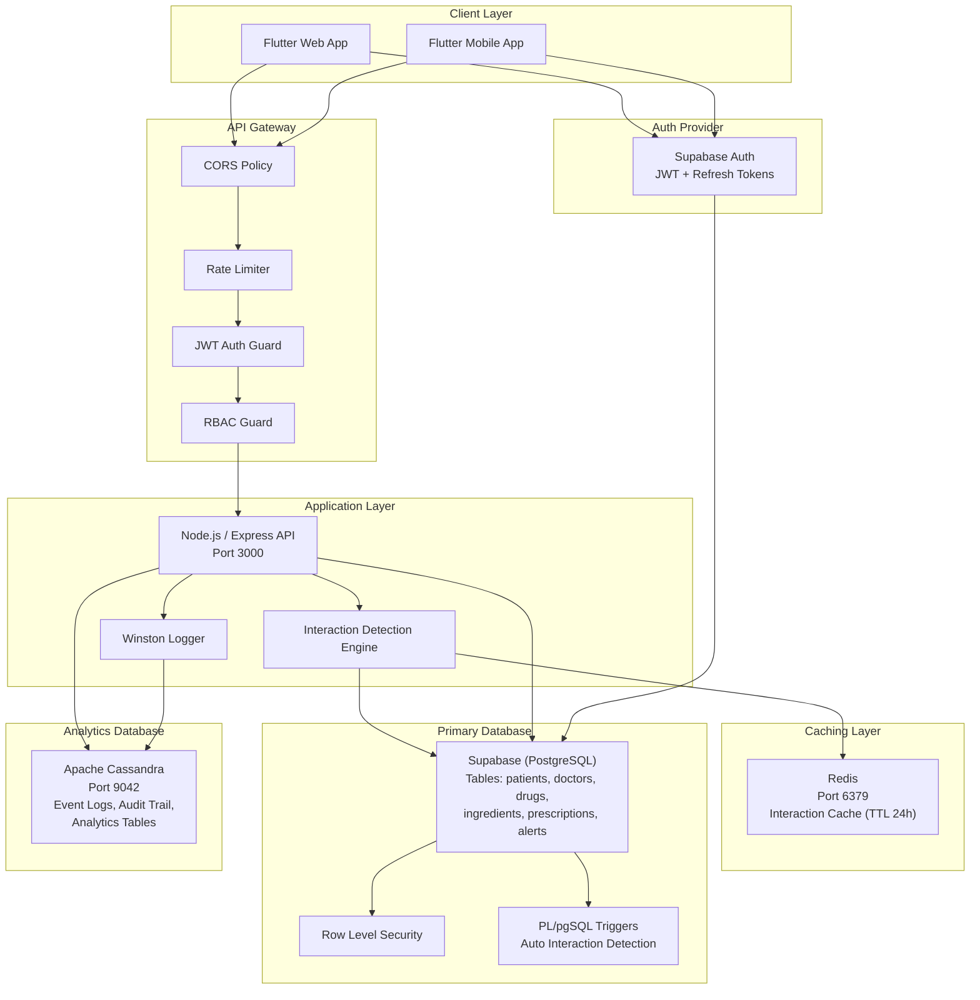
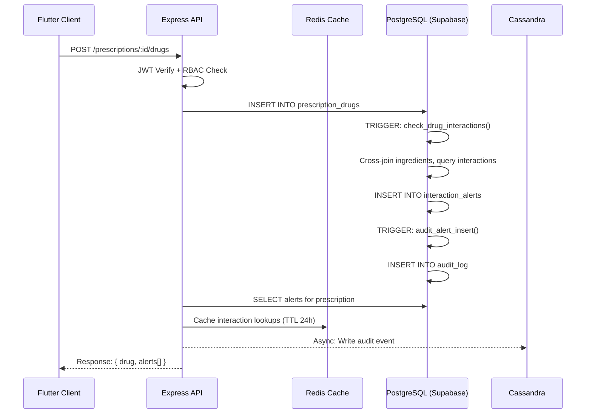
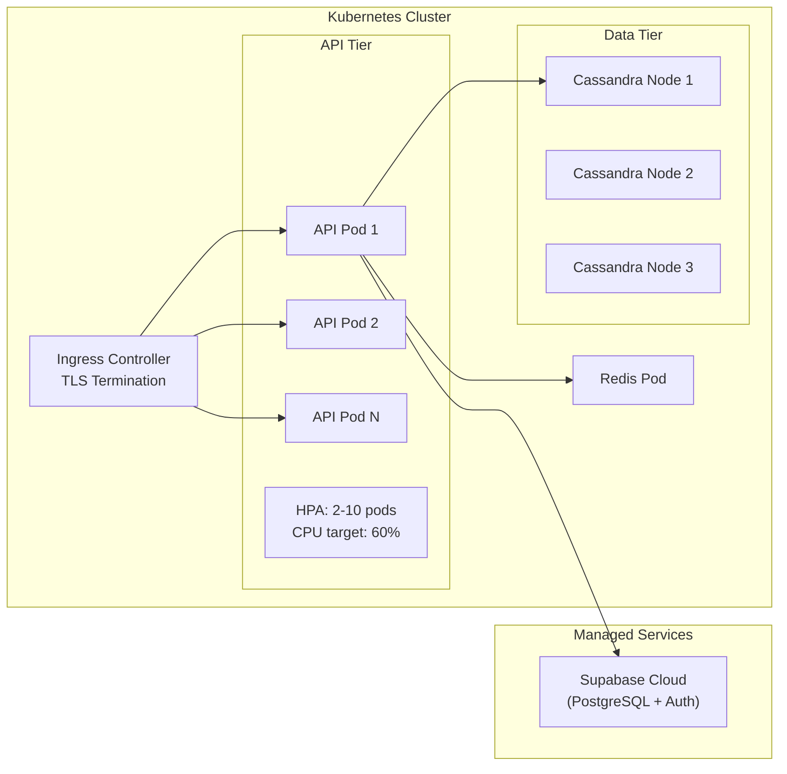

# System Architecture — Drug Interaction Safety & Prescription Validation System

## High-Level Architecture

## Data Flow — Prescription Drug Addition

## Component Responsibilities

| Component | Responsibility |
|-----------|---------------|
| **Flutter App** | UI rendering, state management (Riverpod), auth flow, real-time subscriptions |
| **Express API** | Request routing, validation (Zod), business logic orchestration, auth enforcement |
| **Interaction Engine** | Core algorithm: ingredient pairing, interaction lookup, severity ranking |
| **PostgreSQL** | ACID transactions, referential integrity, triggers, RLS, stored procedures |
| **Cassandra** | High-volume event storage, time-series analytics, audit trail |
| **Redis** | Ingredient interaction cache, reducing DB load on repeated lookups |
| **Supabase Auth** | JWT issuance, refresh token rotation, user management |

## Deployment Architecture

